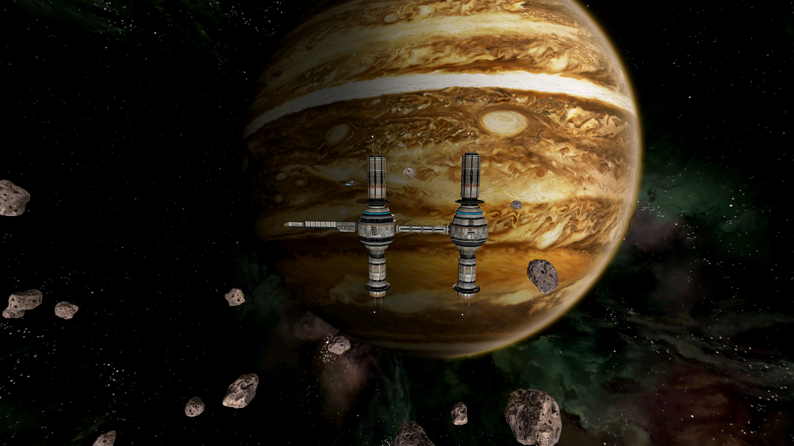
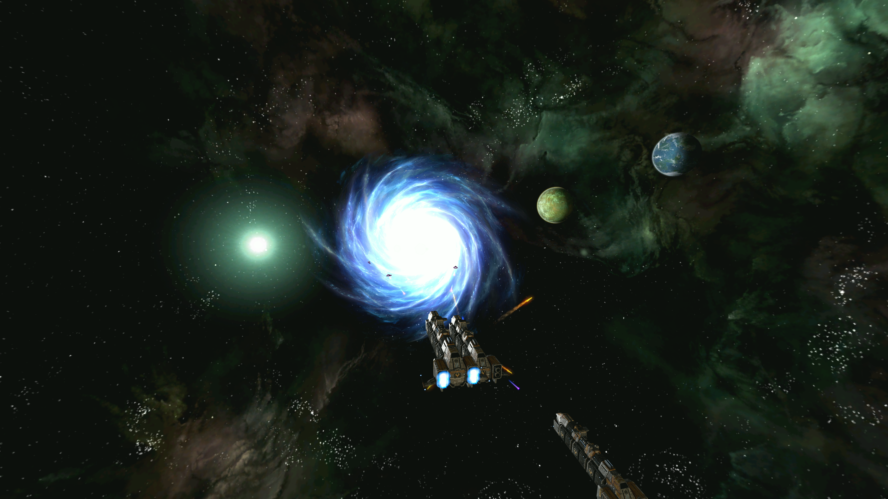
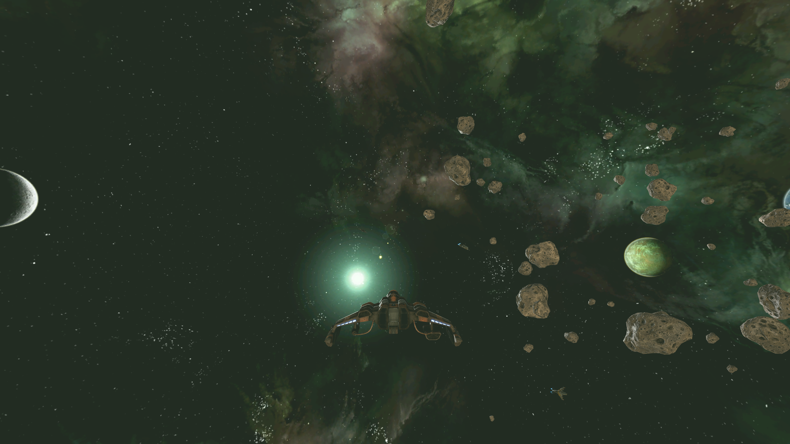

# Galaxian2

**A native, open-source Galaxy on Fire 2 remake.** Fly the opening story, take
contracts, trade and explore the first supported star systems.

**You need your own Galaxy on Fire 2 Full HD Mac `.dmg` to play, on every platform.**
The game imports it locally on first launch. Game assets and the original
executable are not included in the download. No original executable is run.



## Download and play

Get the **[latest prerelease](https://github.com/TheWWWorm/galaxian2/releases)**.
This is an early playable preview, not the complete game.

| Download | Platform | Launch |
| --- | --- | --- |
| Windows x64 | Windows 10/11, Intel or AMD 64-bit | Extract the ZIP, then open `Galaxian2.exe` |
| Linux x64 | Modern Linux with glibc, Intel or AMD 64-bit | Extract the archive, then run `./Galaxian2` |
| macOS Apple Silicon | M-series Macs | Extract the ZIP and open `Galaxian2.app` |

Desktop packages include the engine and offline import helpers. Keep each package
intact. Windows and macOS builds are unsigned. Linux is the tested platform;
Windows and macOS exports have not yet been tested on their native systems.
Android and Web builds are not included in this preview.

1. Start Galaxian2 and choose **Mac .dmg**.
2. Select your **Galaxy on Fire 2 Full HD Mac disk image**. Allow several minutes
   and at least **8 GB of free space** for extraction and preparation.
3. Choose **Start new game**. Follow the opening instructions.

Later launches reuse your local import. Cancelling an import preserves an existing
installation and its saves. Mac Full HD 1.0.6 content is verified. A tested disk
image labelled 1.0.7 contains the same game files; the additional ships advertised
for the official 1.0.7 update are not yet verified. Other layouts may report that
they are unsupported.

## What's playable

- The opening encounter and rescue, mining and equipment tutorials, combat
  training, early station journeys and four introductory jobs.
- The convoy, capture at Alioth, battle and escape, through the original
  conversation that unlocks free travel.
- Local travel in Augmenta and the Gome C–Dis jumpgate journey to Magnetar and back.
- Station docking, item buying and selling, supported equipment fitting, and
  courier/passenger contracts to implemented destinations.
- Station saves, autosaves, loading and retrying from a saved station after death.
- Main menu, display and sound settings, language selection, mouse/controller input and optional
  larger touch controls. Play is landscape only.

This preview also includes the trip through Magnetar to Union, the
Suttnar conversation, and saving, shopping and travel to Tornard afterward.
**Kappa is still unfinished:** after completing Suttnar, you cannot yet return
through Union's jumpgate.



## Controls and station services

Follow the tutorial prompts for flying, targeting, firing and mining.

| Action | Controls |
| --- | --- |
| Steer | **Mouse**, **WASD** or **arrow keys** |
| Fire / mine | **Left click** or **Space** |
| Main menu / pause | **Esc** |
| Toggle fullscreen | **F11** |
| Navigation map in flight | **M** |
| Hangar at a station | **H** |
| Space Lounge at a station | **L** |
| Save / load at a supported station | **F5 / F9** |
| Confirm / back | **Enter / Esc** |

Mouse steering is enabled by default on desktop. Move the mouse to turn your ship;
the cursor is released in menus, maps and station screens. **Options** lets you
adjust mouse sensitivity, invert pitch or turn mouse steering off.

After free travel unlocks, use **M** to plot a course. Travel to Gome C or Dis to
reach its system's jumpgate, select the other system and a destination, and
confirm the course. **Enter** accepts the gate question; **Esc** opens its map.

At a station, **Hangar** buys and sells one item per action. **Cargo → Mount**
installs supported equipment; **Ship → Demount** removes it. Check cargo capacity
before departing. Some replacements need confirmation.

**Space Lounge** shows job requirements and destinations. Couriers need cargo
space; passengers need installed cabin berths. Accept a supported job, travel to
its marker and dock. **Close** the delivery result to receive payment. Finish
fitting before accepting a job.

## Display settings

Open **Options** to choose your display mode, window resolution, aspect ratio and
frame rate. **Fullscreen** uses your display's native resolution, including Retina
and ultrawide displays. Windowed mode offers common resolutions and **Native**,
fitting the window within your desktop when necessary.

**Automatic** aspect ratio fills the window without stretching the scene.
**Native display** matches your monitor's ratio; fixed ratios add bars as needed.
**Unlimited (V-Sync off)** removes the frame cap. You can also choose a fixed FPS
limit or **Display refresh (V-Sync)**. These settings are remembered between launches.

**UI scale** automatically enlarges menus and flight controls on high-resolution
displays. Choose **75%–300%** for a fixed size, or return to **Automatic**. Smaller
windows limit the scale so controls remain reachable. The 3D view keeps its full
resolution.

Windows and Linux use Vulkan by default; Apple Silicon uses Metal. Older GPUs
can fall back to OpenGL. If a graphics driver cannot start the game, try launching
with `--rendering-method gl_compatibility --rendering-driver opengl3`. On Windows,
`--rendering-method mobile --rendering-driver vulkan` explicitly selects Vulkan.

## Saves

Finish a station conversation and close its services before saving. Autosaves
also occur at supported service exits, acknowledged results and departures.
**Resume** returns to your running game, or loads the saved station after a
restart or death. A previous-save backup protects against an interrupted write.

Saving during flight or a conversation is unavailable. Saves belong to their
imported content and gameplay-data version. Original game saves and migration
between incompatible versions are not supported yet. Back up your user-data
folder before updating an early preview.

## Still in development

The remaining campaign, Valkyrie, Supernova, broader galaxy travel, ship purchases,
several weapon/device types, cross-system contracts and some menu presentation
are unfinished. Unavailable missions and offers stay locked. The menu currently
uses the Normal difficulty profile; Supernova Challenge is disabled.

Screenshots show the native engine using locally imported Mac content. They are
promotional images, not game resources distributed with the engine.



## Help and feedback

Report problems in **[GitHub Issues](https://github.com/TheWWWorm/galaxian2/issues)**.
Include your operating system, release version, steps to reproduce and any error
message. Do not upload your DMG, original executable, imported content or saves
to public issues.

## Run from source

Use Godot **4.7**, Python **3.10+**, and 7-Zip (`7zz` or `7z`). Install the importer
dependencies in a Python environment, set `GOF2_IMPORT_PYTHON` to that environment's
Python executable, then run:

```sh
python -m pip install -r tools/requirements-visuals.txt -r tools/requirements-bindings.txt
godot --path game
```

If 7-Zip is not on PATH, set `GOF2_7ZIP` to its executable. Source checks and build
commands are available through `python tools/run_checks.py --help` and
`python tools/package_releases.py --help` (packaging requires Python 3.12+). Original content stays outside the
source tree and release packages.

## License

The engine is licensed under [Apache 2.0](LICENSE.md).
[Third-party notices](THIRD_PARTY_NOTICES.md) cover reused components.
Galaxy on Fire 2 and its original content belong to their respective rights
holders. This is an independent, unofficial project.
